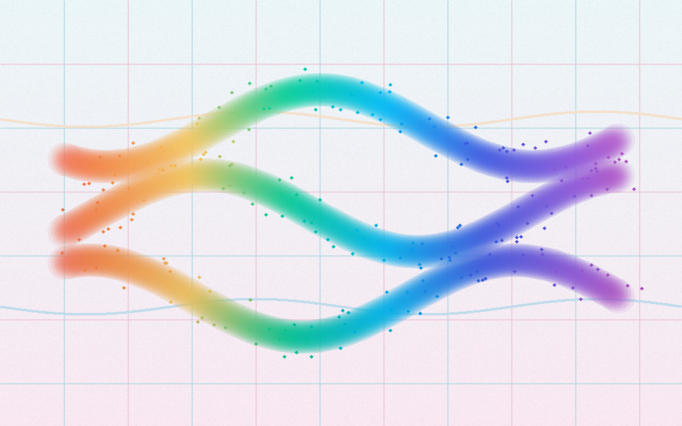
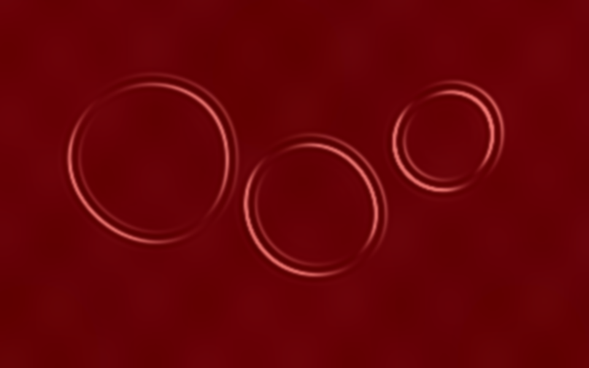
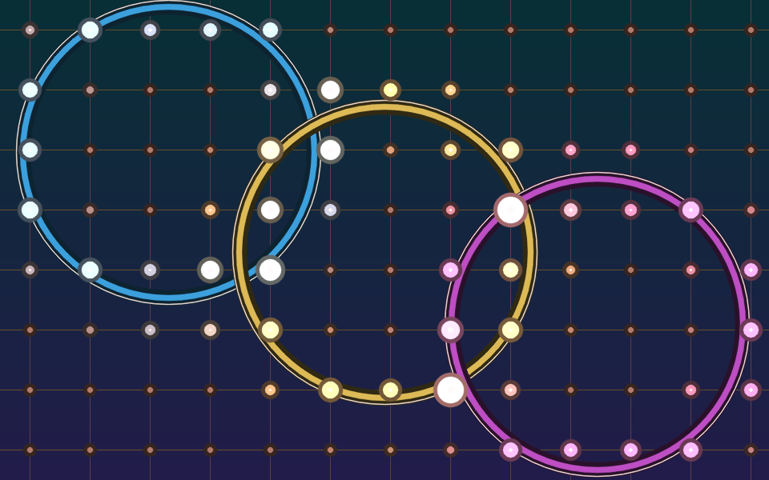
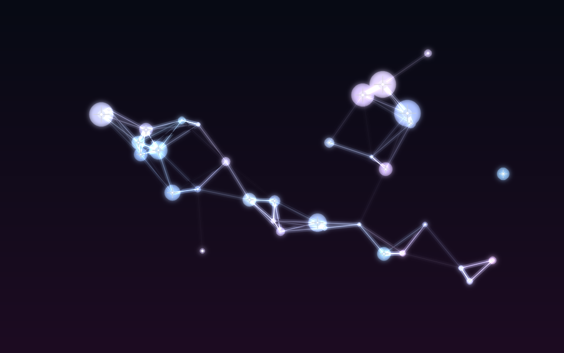
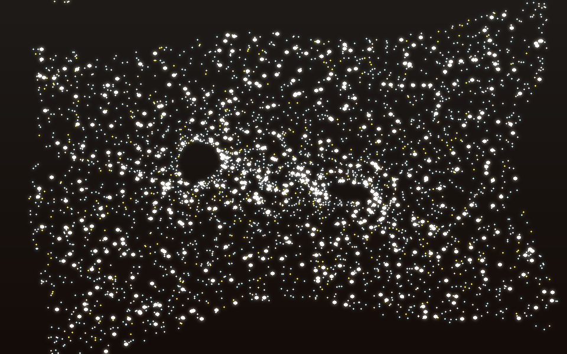
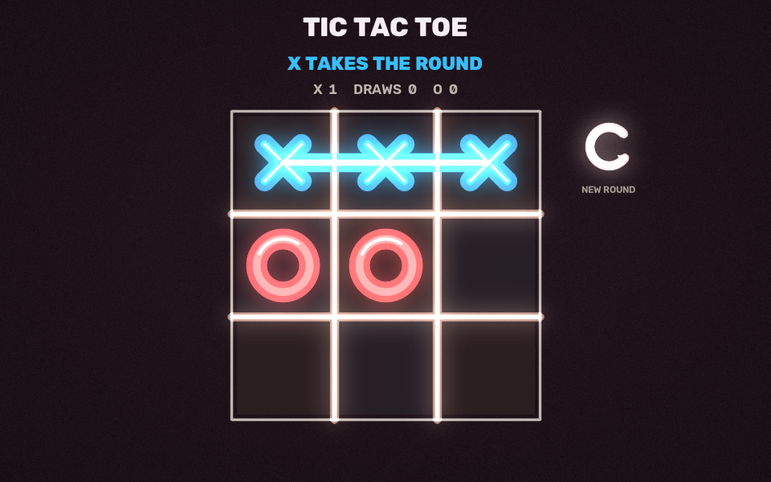
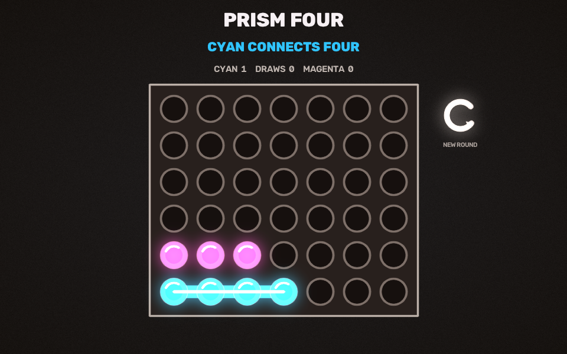
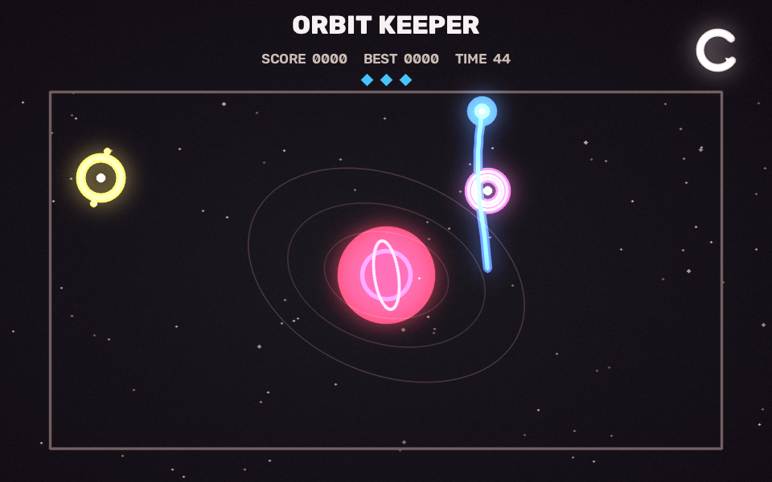

# Projector Interaction

Turn a projector and a RealSense or Orbbec RGB-D camera into an interactive
wall. The camera maps depth foreground into projector coordinates with a
four-point homography, while aligned depth measures its distance from a
calibrated empty wall in millimeters. RGB-D mode fuses MediaPipe's
index-fingertip location with depth at that aligned pixel. A standard external
RGB camera remains available as a fallback.

The application prefers a connected RealSense, then an Orbbec, automatically.
It never selects the known PC webcam as its RGB fallback.

## Modes

- `paint`: textured soft brush strokes, pigment flecks, and a paper-like canvas
- `spill`: luminous watercolor pigment mixing across a full-bleed surface
- `ripple`: reflective crimson liquid with pale highlights and touch-driven waves
- `pulse`: layered luminous rings across a reactive jewel-tone grid
- `constellation`: fading stars connected by fine luminous lines
- `sand`: metallic grains attracted into touch-driven vortices
- `tic-tac-toe`: two-player touch board with scores and projected round reset
- `connect-four`: two-player prism board with animated drops and win trails
- `orbit-keeper`: steer a comet through beacons using temporary gravity wells

## Projection Gallery

These are direct frames from the projector renderers. Camera, calibration, and
debug overlays are not included.

<table>
  <tr>
    <td align="center"><br><strong>1. Paint</strong></td>
    <td align="center"><br><strong>2. Spill</strong></td>
    <td align="center"><br><strong>3. Ripple</strong></td>
  </tr>
  <tr>
    <td align="center"><br><strong>4. Pulse</strong></td>
    <td align="center"><br><strong>5. Constellation</strong></td>
    <td align="center"><br><strong>6. Magnetic Sand</strong></td>
  </tr>
  <tr>
    <td align="center"><br><strong>7. Tic Tac Toe</strong></td>
    <td align="center"><br><strong>8. Prism Four</strong></td>
    <td align="center"><br><strong>9. Orbit Keeper</strong></td>
  </tr>
</table>

`spill` is the default. Empty-wall calibration learns depth and per-pixel
sensor noise. The hand tracker identifies the fingertip in color, then accepts
contact only when aligned metric depth places it at the calibrated 3D plane.
Four guided corner touches refine the camera/projector mapping and fit that
physical plane from deprojected `(x, y, z)` samples using the camera intrinsics.
The
legacy near-wall blob tracker remains available with `--legacy-depth-blob`.

## Requirements

- Linux with Video4Linux2; USB 3 recommended
- Python 3.10 or newer
- Projector configured as a display
- Intel RealSense D435i/D455 or Orbbec Gemini RGB-D camera
- Optional external RGB camera fallback

## Quick Start

```bash
git clone https://github.com/manavgoel472003/Projector_interaction.git
cd Projector_interaction
./install.sh
# Orbbec only: install its udev rule, then unplug and reconnect it.
./scripts/install_orbbec_udev.sh
./run_wall_touch_demo.sh --fresh
```

`install.sh` creates `.venv`, installs pinned runtime dependencies, downloads
the MediaPipe model used by RGB fallback, verifies its SHA-256 checksum, and
runs the tests. The udev command installs Orbbec's official Linux USB
permissions and requires your sudo password once.

With a RealSense connected, `--sensor auto` selects synchronized depth aligned
to the color image, enables the high-accuracy stereo preset and IR emitter when
the model supports them, and applies spatial/temporal filtering. Force it when
diagnosing setup:

```bash
./run_wall_touch_demo.sh --sensor realsense --fresh
```

The camera must appear in `lsusb` as an Intel RealSense device. Use a direct
USB 3 connection; hubs and USB 2 links can reduce or prevent the requested
aligned `1280x720/30 FPS` stream.

With a Gemini connected, the same automatic mode selects synchronized,
hardware-aligned color and depth. Force it with:

```bash
./run_wall_touch_demo.sh --sensor orbbec --fresh
```

The Gemini must appear in `lsusb`; Gemini 336 reports `2bc5:0803`. If it does
not, reconnect it with the supplied USB 3 data cable before debugging software.
On USB 2.1, the app automatically selects the tested bandwidth-safe hardware
alignment profile at `640x480/15 FPS`; USB 3 permits higher-bandwidth profiles.

### RGB fallback

The launcher automatically discovers the primary video stream of a connected
external V4L2 camera. It prefers stable `/dev/v4l/by-id` paths, so replacing a
camera does not require editing the launcher. If several external cameras are
connected, select one explicitly:

```bash
./run_wall_touch_demo.sh \
  --sensor rgb \
  --camera /dev/v4l/by-id/<external-camera>-video-index0 \
  --fresh
```

Do not use `/dev/video0` style numeric indexes unless you have independently
verified the device. Explicit paths such as `--camera /dev/video4` work, but
ambiguous numeric arguments such as `--camera 4` are intentionally refused.
The camera can also be selected persistently with `WALL_TOUCH_CAMERA`.

Camera format is selected automatically. The Logitech `046d:0825` uses raw
`YUYV 640x480/30` because its MJPEG stream produces corrupt-frame warnings.
Format and stream settings can be overridden when testing other hardware:

```bash
./run_wall_touch_demo.sh \
  --camera-format yuyv --camera-width 640 --camera-height 480 --camera-fps 30
```

## Calibration

1. Fix the projector and camera in place.
2. Click the four projected targets in the laptop debug window in this order:
   top-left, top-right, bottom-right, bottom-left.
3. Keep the projected area empty while 45 wall-depth frames are collected
   (about three seconds on the USB 2.1 profile).
4. Touch and hold the four corner targets in order with a straight index
   finger. Each advances automatically after stable depth samples are captured.
5. Touch or drag inside the projected region.

After four-point calibration, contact activates immediately when the fingertip
enters the plane's default `18 mm` approach band. Adjust
`--touch-plane-tolerance-mm` if needed; lower values require the finger to be
closer to the calibrated plane.

### Close bottom placement

For a RealSense mounted below the projection, close to the wall and aimed
upward, use:

```bash
./run_wall_touch_demo.sh --close-bottom --fresh
```

Mount the camera about `30-45 cm` from the wall, centered under the projected
area, and aim it toward the projection center. Keep the complete projection
inside the camera image with a small border. This preset selects
`640x480/30 FPS` High Density depth for the taller field of view and best
measured close-range coverage, then uses 60 empty-wall frames, 14 stable samples
per corner touch, full-detail hand detection, a larger 12-pixel aligned-depth
patch, a `+/-12 mm` corrected contact band, and immediate activation. Runtime
touches do not require MediaPipe's index-extension pose classification after
the four calibration touches are complete.

Geometry is stored in `wall_touch_calibration.json`; the depth reference and
noise map are stored in `wall_touch_calibration.depth.npz`. Both are local and
ignored by Git. Use `--fresh` or press `r` after moving the camera, projector,
or wall.

To keep the four projection points but relearn the empty-wall depth:

```bash
./run_wall_touch_demo.sh --recalibrate-depth
```
See [docs/hardware-setup.md](docs/hardware-setup.md) for placement and display
details.

## Controls

| Key | Action |
| --- | --- |
| `1`-`9` | Select any mode directly; games occupy `7`-`9` |
| `]` / `m` | Next mode |
| `[` | Previous mode |
| `c` | Clear artwork and keep calibration |
| `t` | Relearn wall depth (or RGB touch scale in fallback mode) |
| `r` | Clear artwork and choose new projection points |
| `f` | Toggle projector fullscreen |
| `q` / `Esc` | Quit |

## Development

```bash
./install.sh
make test
make previews
.venv/bin/wall-touch-demo --help
```

Repository layout:

```text
wall_touch_paint.py    camera, calibration, interaction loop
wall_touch_realsense.py  filtered, color-aligned RealSense RGB-D capture
wall_touch_orbbec.py  synchronized Orbbec RGB-D capture
wall_touch_core.py     geometry, depth-background tracking, and touch gates
wall_touch_effects.py  original visual simulations
wall_touch_ambient_effects.py  ambient and field simulations
wall_touch_games.py    touch-controlled games and press debouncing
wall_touch_connect_four.py  Prism Connect Four rules and renderer
wall_touch_orbit_keeper.py  Orbit Keeper physics and renderer
tests/                 deterministic unit tests
scripts/               model setup utility
docs/                  hardware and calibration notes
```

## Limitations

Depth accuracy is limited by depth resolution at longer camera distances and
by reflective or transparent walls. Guided calibration learns the measured
open-hand contact range, rejects approach frames beyond `60 mm`, and tracks the
palm-sized contact patch instead of a fingertip. Move the camera closer when
possible. RGB fallback still uses MediaPipe and approximate hand size.

No software license has been selected for this repository yet. Add one before
publishing if others should be allowed to copy, modify, or redistribute it.
